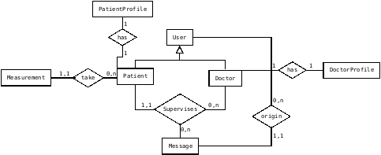

# BPress: Blood Pressure Control Assistant

I present an application to assist a patient in controlling their blood pressure. A patient will be able to record new blood pressure measurements and consult the measurement history. The app also allows a patient to be supervised by a doctor, allowing for more than one supervising doctor. Both patients and doctors will be able to exchange messages, maintaining a message history for each patient-supervising doctor pair in “Chat” format.

## Distinctiveness and Complexity

In my opinion, the application presented is different from the other projects carried out in the course both in its objective and in the methods used to carry it out. Following the requirements, the application has been divided into two parts:

- **Backend**: Implements a Rest API made with the “Django Rest Framework”, this framework has not been used in any of the other projects in the course. The data model used meets the complexity criteria. Four entities are modeled (PATIENT, DOCTOR, MEASUREMENT, MESSAGE) and several relationships, both “1:1”, “1:N” and “N:M”. See the data model shown in Figure 1.

**Figure 1**. Entity-Relationship Model.

- **Front-End**: Consists of two WEB applications. I have used the “Single Page Application” model. The applications have been implemented using the “React.js” framework. This framework has not been used in any of the other projects in the course. Several components such as “MessageList”, “MeasurementList”, “Header”, “Home”, …, have been implemented. I have used version 12 of Node.js with the “react@18.2.0” package

To provide “mobile-responsive”, the CSS framework “bootstrap5” has been used with the “flex-box” and “grid” styles. Breakpoints have been set for small devices, such as mobile, and large devices, such as desktop/tablets. I have used the “reacstrap@9.2.0” package.

## Folder contents
The content of the folders is as follows:

- **`bpress_backend`** folder: Contains the “backend” of the application. It is a Django application that uses the “Django Rest Framework” package to implement a Rest API that provides access to the data model by WEB applications. Its structure is the standard one of a Django project, highlighting:
    - `models.py` file where the relational model corresponding to the data model shown in Figure 1 is implemented.
    - `serializers.py` file where the JSON serializers used to transmit data between the backend and frontend are implemented.
    - `views.py`file where the Rest API is implemented.

- **`bpress_doctor`** folder: contains a React.js application which is used by a doctor to monitor his patients. The folder structure is standard for a React.js application, highlighting the “src/components” folder that contains the implemented components such as “Header.js”, “Home.js”, “MessageList.js”, “MeasurementList ", "LoginForm.js", "CreateSelectPatient.js", among others.

- **`bpress_patient`** folder: contains a React.js application which is used by a patient to store/review the blood pressure measurements taken and exchange messages with their supervising doctor to ask questions. The folder structure is standard for a React.js application, highlighting the “src/components” folder that contains the implemented components such as “Header.js”, “Home.js”, “MessageList.js”, “MeasurementList ", "LoginForm.js", "NewMeassurementForm.js", among others.

## How to run

### Backend execution

In the folder `capstone` execute:

`python manage.py runserver`

### Running the “bpress_patient” application

Install nodejs package "serve" (if it is necessary)

`npm install --global serve``

In the folder `capstone/bpress_patient` execute:

`serve -s build`

Open in the browser the url `http://localhost:3000`

### Running the “bpress_doctor” application

In the folder `capstone/bpress_doctor` execute:

`serve -s build`

Open in the browser the url `http://localhost:3000`